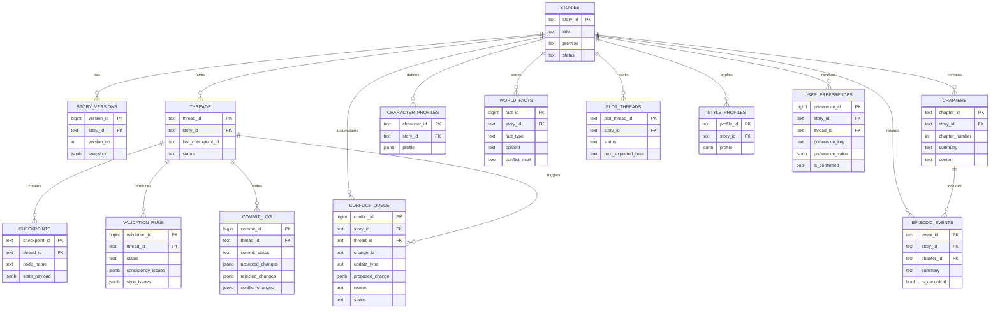

# ER 图与实体关系

## 实体职责

- `stories`: 作品根对象
- `story_versions`: 完整状态快照版本
- `threads`: 多轮交互线程
- `checkpoints`: LangGraph 节点级检查点
- `chapters`: 章节正文与摘要
- `character_profiles`: 角色状态和口吻档案
- `world_facts`: 世界规则、设定事实和 conflict-marked fact
- `plot_threads`: 主支线和伏笔推进
- `episodic_events`: 规范化事件记忆
- `style_profiles`: 风格约束和 exemplar 统计
- `user_preferences`: 用户偏好与禁用项
- `validation_runs`: 每轮验证结果
- `commit_log`: 提交、回滚和 conflict 审计记录
- `conflict_queue`: 与旧设定冲突、待人工处理的 proposal 队列
