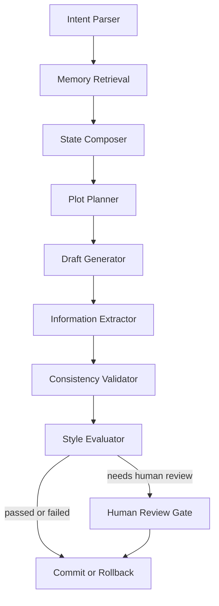

# 节点流程图

## 节点说明

- `Intent Parser`: 解析续写、改写、仿写、校验
- `Memory Retrieval`: 取回事件、事实、角色、风格、偏好
- `State Composer`: 组装当前工作态
- `Plot Planner`: 决定本轮推进点
- `Draft Generator`: 生成候选正文
- `Information Extractor`: 从正文抽取新增状态
- `Consistency Validator`: 查设定、时间线、人物知识边界冲突
- `Style Evaluator`: 查风格偏差与角色口吻偏差
- `Commit / Rollback`: 通过则提交，否则回滚

## 扩展三层流程（先分析再续写）

在处理超长原文（例如 300KB）时，建议在现有节点链路外增加前置三层：

1. 分析层：对原文分块抽取角色卡、剧情线、世界规则、风格画像、事件样例与原文句子资产。
2. 检索层：按用户指令组装 Evidence Pack（事实约束 + 风格句子 + 事件样例）。
3. 生成落地层：先计划后生成，生成后做一致性与风格校验，不通过则进入修正提示回路。

详细建模与执行方案见：`docs/02_authoring_and_domain_model/11_style_capture_modeling.md`
