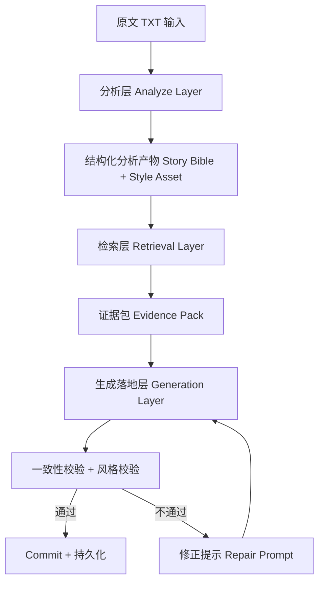

# 作者风格捕获与先分析后续写建模方案

## 1. 目标与设计原则

本方案解决两个核心问题：

1. 超长原文（例如 300KB）无法一次喂给模型时，如何先分析再续写。
2. 如何最大化保留原作者写法，包括动作神态、人物描写、外貌描写、环境描写、对话节奏和用词习惯。

设计原则：

- state-first：所有分析结果都进入结构化状态，不依赖一次性 prompt。
- evidence-first：续写必须附带原文证据片段，避免风格漂移。
- layered-pipeline：分析层 -> 检索层 -> 生成落地层。
- validate-before-commit：先校验一致性与风格，再提交持久化。

## 2. 三层架构总览

## 3. 分析产物模型（新增重点）

在现有 `NovelAgentState` 上新增或扩展以下“分析资产”。

### 3.1 角色卡 Character Card

- 静态信息：姓名、身份、外貌锚点、说话习惯。
- 动态信息：目标、恐惧、关系变化、知识边界。
- 风格偏好：该角色常见动作词、情绪表达方式、对话长度分布。

建议字段：

- `character_id`
- `appearance_profile`
- `voice_profile`
- `gesture_patterns`
- `dialogue_patterns`
- `state_transitions`

### 3.2 剧情线 Plot Thread

- 主线/支线目标、阶段、关键转折点。
- 每条线对应的证据事件与未解问题。

建议字段：

- `thread_id`
- `stage`
- `stakes`
- `open_questions`
- `anchor_events`

### 3.3 世界规则 World Rules

- 可验证规则、禁则、时间线约束、空间约束。
- 规则来源证据句。

建议字段：

- `rule_id`
- `rule_text`
- `rule_type`（硬规则/软规则）
- `source_snippets`

### 3.4 风格画像 Style Profile

这是本需求的关键资产。

拆分为：

- 叙事句法：长短句比例、并列句倾向、停顿习惯。
- 描写分布：动作/神态/外貌/环境/心理占比。
- 对话风格：每轮发言长度、语气词、打断方式、潜台词强度。
- 修辞偏好：比喻类型、意象复用、收束句型。
- 用词指纹：高频动词、高频形容词、特征短语。

建议字段：

- `sentence_length_distribution`
- `description_mix`
- `dialogue_signature`
- `rhetoric_markers`
- `lexical_fingerprint`
- `negative_style_rules`

### 3.5 事件样例库 Event Style Case（新增）

将“一个事件如何被作者写出来”存成可检索样例。

每个样例含：

- 事件语义：冲突类型、角色关系、情绪走势。
- 叙事实现：动作链、神态链、环境映射、关键对话。
- 原文片段：精确来源句，带位置索引。

建议字段：

- `case_id`
- `event_type`
- `participants`
- `emotion_curve`
- `action_sequence`
- `expression_sequence`
- `environment_sequence`
- `dialogue_turns`
- `source_snippet_ids`

### 3.6 原文句子资产 Snippet Bank（新增）

你提出的“存一些原文句子后续校验与模仿”非常关键，建议作为一等资产。

句子类型：

- `action`
- `expression`
- `appearance`
- `environment`
- `dialogue`
- `inner_monologue`

建议字段：

- `snippet_id`
- `snippet_type`
- `text`
- `normalized_template`
- `style_tags`
- `speaker_or_pov`
- `chapter_number`
- `source_offset`
- `embedding`

## 4. 分析层（Analyze Layer）详细流程

### 4.1 文本切分

针对 300KB 文本，采用分层切分：

1. 章节级切分（优先按标题/章号规则）。
2. 场景级切分（按时间、地点、出场人物变化）。
3. 段落窗口切分（用于抽取句法和描写细节）。

### 4.2 一级抽取（块内）

每个 chunk 抽取：

- 事件
- 角色状态变化
- 世界规则线索
- 对话结构
- 描写片段（动作/神态/外貌/环境）
- 代表性原文句

输出：`chunk_analysis_result[]`

### 4.3 二级归并（全局）

对所有 chunk 进行合并去重：

- 合并同一角色别名
- 合并同一事件链路
- 冲突事实标记
- 形成 Story Bible 版本

输出：

- `character_cards`
- `plot_threads`
- `world_rules`
- `style_profile`
- `event_style_cases`
- `snippet_bank`

### 4.4 分析质量门槛

建议最少检查：

- 角色覆盖率（主要角色是否都被抽到）
- 事件覆盖率（每章是否至少一个关键事件）
- 风格覆盖率（六类 snippet 是否充足）
- 冲突率（冲突事实占比）

## 5. 检索层（Retrieval Layer）详细流程

输入：用户指令 + 当前续写目标 + 最新状态。

### 5.1 查询拆解

将用户指令拆为可检索意图：

- 情节推进目标
- 角色关注目标
- 风格约束目标
- 禁止项

### 5.2 多通道检索

- 语义检索：从 `snippet_bank` 取风格相近句。
- 结构检索：从 `event_style_cases` 取同类事件写法。
- 事实检索：从 `character_cards/world_rules/plot_threads` 取硬约束。

### 5.3 证据包组装 Evidence Pack

续写前固定组装：

- 本轮必须遵守的事实约束
- 可模仿的原文句（按类型配额）
- 可参考的事件样例
- 目标风格参数（句长、对话比例、描写比例）

建议“句子配额”示例：

- 动作 3 句
- 神态 2 句
- 外貌 1 句
- 环境 2 句
- 对话 3 句

## 6. 生成落地层（Generation Layer）详细流程

### 6.1 计划先行

先生成结构化计划，再生成正文：

- `planned_beat`
- `scene_intent`
- `character_move_plan`
- `style_targets`

### 6.2 受约束生成

生成输入必须包含：

- Evidence Pack
- 用户指令
- 当前章节目标
- 禁止项

### 6.3 生成后抽取与校验

按现有状态机继续：

- `information_extractor`
- `consistency_validator`
- `style_evaluator`
- `commit_or_rollback`

### 6.4 冲突检查与修正提示

冲突类型：

- 设定冲突（世界规则、时间线）
- 人物冲突（知识边界、口吻偏差）
- 风格冲突（句法漂移、描写失衡）

修正提示建议模板：

1. 指定冲突点（事实或风格）。
2. 给出证据（引用 snippet_id + 原文句）。
3. 指定修正方向（保留情节目标、修正风格实现）。
4. 约束不得改动的已确认内容。

## 7. 与现有状态优先架构的映射

可直接映射到现有 `NovelAgentState`：

- `story.characters` 承载角色卡核心字段。
- `story.major_arcs` 承载剧情线。
- `story.world_rules/public_facts/secret_facts` 承载世界规则。
- `style` 承载风格画像核心指标。
- `memory` 承载本轮检索切片。
- `metadata` 承载分析版本号、snippet 引用、case 引用。

建议扩展点：

- 在 `metadata` 增加：
  - `analysis_version`
  - `evidence_pack`
  - `retrieved_snippet_ids`
  - `retrieved_case_ids`

## 8. 建议新增存储表（可选）

为保证可审计与可复用，建议新增：

- `style_snippets`
- `event_style_cases`
- `analysis_runs`
- `story_bible_versions`

每条记录都带 `source_span` 与 `chapter_number`，确保“能追溯到原文”。

## 9. 续写任务的具体完成流程（执行版）

1. 导入原文 txt。
2. 运行分析层，生成分析资产（角色卡/剧情线/规则/风格画像/样例库/句子库）。
3. 用户输入续写指令。
4. 检索层按指令组装 Evidence Pack。
5. 生成落地层先出计划，再出正文。
6. 抽取 proposal。
7. 执行一致性与风格校验。
8. 失败则触发修正提示并重试（限定轮次）。
9. 通过则 commit 并持久化。
10. 输出正文 + 状态快照 + 审计日志。

## 10. 分阶段落地建议

### 阶段 A（MVP）

- 做 chunk 分析 + snippet_bank。
- 检索时引入句子配额。
- 在风格校验中新增“描写占比偏差”检查。

### 阶段 B（增强）

- 增加 event_style_cases。
- 引入修正提示自动回写。
- 增强角色口吻一致性评分。

### 阶段 C（规模化）

- 多书并行资产库。
- 风格迁移与角色专属解码配置。
- 统计驱动自动调参。

---

该方案的核心价值是：把“作者写法”从隐式 prompt 变成可检索、可校验、可回放的结构化资产，让模型在超长文本续写里更稳定地模仿原作风格。
