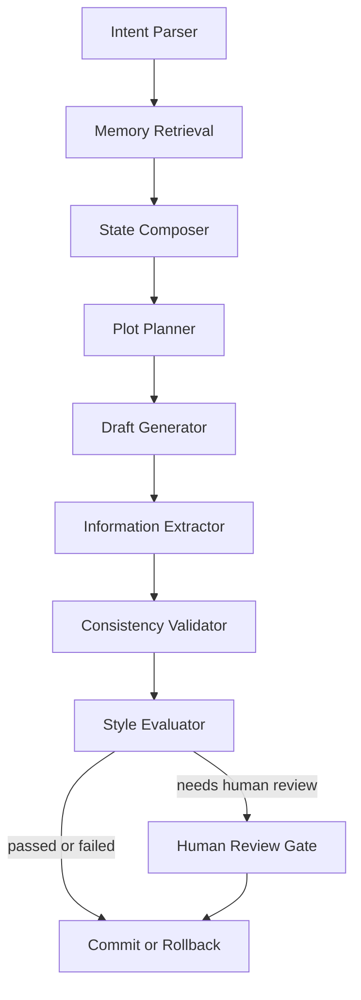

# 节点流程图

## 节点说明

- `Intent Parser`: 解析续写、改写、仿写、校验
- `Memory Retrieval`: 取回事件、事实、角色、风格、偏好
- `State Composer`: 组装当前工作态
- `Plot Planner`: 决定本轮推进点
- `Draft Generator`: 生成候选正文
- `Information Extractor`: 从正文抽取新增状态
- `Consistency Validator`: 查设定、时间线、人物知识边界冲突
- `Style Evaluator`: 查风格偏差与角色口吻偏差
- `Commit / Rollback`: 通过则提交，否则回滚
