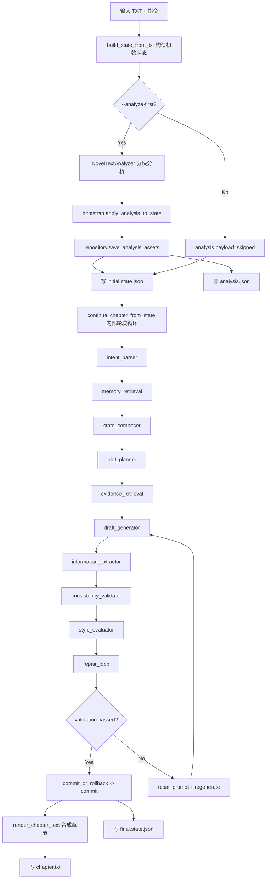

# 2026-03-29 续写引擎改造完整记录

## 1. 文档目的与范围

本文档用于完整记录本轮改造的目标、实现、验证与产物，覆盖：

1. 统一状态模型与状态机升级。
2. 世界规则从关键词匹配升级为 proposal 语义冲突检测。
3. 章节完成判定策略化（可配置参数 + 硬门槛 + 加权阈值）。
4. 运行入口导出统一四产物（analysis / initial state / final state / chapter text）。
5. 当前工作区内所有可见改动文件（基于 `git status --short --untracked-files=all`）。

时间基准：2026-03-29。
分支：`main`。
仓库：`WOO-woo-Waf/narrative-state-engine`。

---

## 2. 目标完成度总览

| 目标 | 状态 | 结果 |
|---|---|---|
| 章节完成判定策略化 | 已完成 | 已接入可配置权重、阈值、最小字数/段落/锚点/剧情推进分；并恢复硬门槛防止过早结束 |
| world rule 语义冲突检测 | 已完成 | 从文本关键词检查升级为基于 proposal 语义的结构化冲突判断 |
| 四产物统一导出 | 已完成 | 统一产出 `*.analysis.json`、`*.initial.state.json`、`*.final.state.json`、`*.chapter.txt` |
| bat 运行模板参数对齐 | 已完成 | 新增并透传章节完成策略参数，支持 initial/final state 分离输出 |
| 回归与冒烟验证 | 已完成 | 回归先失败后修复，最终全量通过；冒烟运行成功落盘四产物 |

---

## 3. 端到端数据流（本轮实现）



---

## 4. 状态模型改造记录

### 4.1 核心扩展

文件：`src/narrative_state_engine/models.py`

主要新增：

1. `WorldRuleEntry`：结构化世界规则（`rule_id/rule_text/rule_type/source_snippet_ids`）。
2. `AnalysisState`：分析资产容器（snippet bank、event cases、evidence pack、检索引用ID等）。
3. `StyleState` 扩展：
   - `sentence_length_distribution`
   - `description_mix`
   - `dialogue_signature`
   - `rhetoric_markers`
   - `lexical_fingerprint`
   - `negative_style_rules`
4. `CharacterState` 扩展：
   - `appearance_profile`
   - `gesture_patterns`
   - `dialogue_patterns`
   - `state_transitions`
5. `PlotThread` 扩展：
   - `stage`
   - `open_questions`
   - `anchor_events`
6. `DraftCandidate` 扩展：
   - `style_constraint_compliance`
   - `rule_violations`
7. `NovelAgentState` 新增字段：`analysis`。

### 4.2 分析映射器

文件：`src/narrative_state_engine/bootstrap.py`

实现 `apply_analysis_to_state(...)`，将分析结果映射到统一状态：

1. style profile -> `state.style.*`。
2. world rules -> `state.story.world_rules_typed` + `world_rules`。
3. 角色卡 -> `state.story.characters` 的结构化画像字段。
4. 剧情线 -> `state.story.major_arcs` 的问题锚点与阶段。
5. snippet/case -> `state.analysis.*` 与 `state.metadata`。

---

## 5. 状态机与节点升级记录

### 5.1 Pipeline/LangGraph 节点链升级

文件：`src/narrative_state_engine/graph/workflow.py`

新增节点：

1. `evidence_retrieval`
2. `repair_loop`

主链路顺序调整为：

`intent_parser -> memory_retrieval -> state_composer -> plot_planner -> evidence_retrieval -> draft_generator -> information_extractor -> consistency_validator -> style_evaluator -> repair_loop -> (human_review_gate|commit_or_rollback)`

### 5.2 Evidence Pack 检索

文件：`src/narrative_state_engine/retrieval/evidence_pack_builder.py`

实现内容：

1. 双通道评分：语义分 + 结构分。
2. 类型配额选取：action/expression/appearance/environment/dialogue/inner_monologue。
3. 事件样例评分：按计划推进、参与者匹配、对话/环境风格约束打分。
4. 输出 `retrieved_snippet_ids` 与 `retrieved_case_ids` 用于审计与可追溯。

### 5.3 生成提示增强

文件：`src/narrative_state_engine/llm/prompts.py`

加入到 draft prompt 的上下文：

1. 风格统计。
2. 检索到的风格句样例。
3. 事件样例。
4. repair prompt。
5. 泛化指令下的“自然续写原则”。

### 5.4 校验强门控升级

文件：`src/narrative_state_engine/graph/nodes.py`

新增关键能力：

1. negative style rule 违例检测：将命中项写入 `draft.rule_violations`。
2. world rule 语义冲突检测：
   - 从 proposal 的 summary/details/entity/metadata 组装语义文本。
   - 对 hard/soft rule 做禁止项、必需项否定、语义矛盾判断。
3. repair loop：
   - 按失败 issue 构造修复提示。
   - 限次重试生成+抽取+校验。
   - 记录 `repair_history`。

---

## 6. 章节编排与完成判定策略化

文件：`src/narrative_state_engine/application.py`

新增：

1. `ChapterCompletionPolicy`。
2. `ChapterContinuationResult`。
3. `continue_chapter_from_state(...)`：章节内部多轮编排。
4. `_evaluate_chapter_completion(...)`：综合判定。
5. `render_chapter_text(...)` 接入最终章节合成。

### 6.1 判定逻辑

综合分：

`weighted_score = w_chars * char_score + w_structure * structure_score + w_plot * plot_progress_score`

完成条件同时满足：

1. commit status 为 `COMMITTED`。
2. validation status 为 `PASSED`。
3. `char_count >= min_chars`（硬门槛）。
4. `paragraph_count >= min_paragraphs`（硬门槛）。
5. `matched_anchors >= min_structure_anchors`（硬门槛）。
6. `plot_progress_score >= plot_progress_min_score`。
7. `weighted_score >= completion_threshold`。

说明：本轮回归修复重点是恢复第 3 与第 5 项硬门槛，防止单轮软分过高提前收敛。

---

## 7. 运行入口与四产物输出

### 7.1 Python 入口脚本

文件：`run_novel_continuation.py`（新增）

新增能力：

1. 支持 `--analyze-first` 分析链路。
2. 支持章节轮次与完成策略参数：
   - `--chapter-rounds`
   - `--chapter-min-chars`
   - `--chapter-min-paragraphs`
   - `--chapter-min-anchors`
   - `--chapter-plot-progress-min-score`
   - `--completion-weight-chars`
   - `--completion-weight-structure`
   - `--completion-weight-plot`
   - `--completion-threshold`
3. 四产物固定输出：
   - `analysis.json`
   - `initial.state.json`
   - `final.state.json`
   - `chapter.txt`
4. `--analyze-first` 关闭时，仍写 `analysis` 占位 payload（status=skipped）。

### 7.2 正式运行 bat

文件：`run_formal_continuation.bat`（新增）

改造内容：

1. 固化正式参数模板。
2. 新增 `OUT_INITIAL_STATE`。
3. 透传完整 completion policy 参数。
4. 输出命名统一为：`analysis` / `initial.state` / `final.state` / `chapter`。

---

## 8. 分析层与资产持久化改造

### 8.1 分析模块新增

新增目录：`src/narrative_state_engine/analysis/`

新增文件：

1. `models.py`：分析资产模型。
2. `chunker.py`：分块器（章节识别 + 滑窗 + overlap）。
3. `analyzer.py`：分析器（snippet/case/bible/style/profile 抽取）。
4. `__init__.py`：导出统一 API。

### 8.2 仓储层扩展

文件：`src/narrative_state_engine/storage/repository.py`

扩展协议与实现：

1. `save_analysis_assets(...)`。
2. `load_style_snippets(...)`。
3. `load_event_style_cases(...)`。
4. `load_latest_story_bible(...)`。
5. `get_by_version(...)`。
6. `load_story_version_lineage(...)`。

并为内存仓储与 PostgreSQL 仓储同时提供实现。

### 8.3 SQL migration 新增

新增文件：

1. `sql/migrations/001_add_analysis_tables.sql`
2. `sql/migrations/002_story_version_bible_links.sql`

新增核心表：

1. `style_snippets`
2. `event_style_cases`
3. `analysis_runs`
4. `story_bible_versions`
5. `story_version_bible_links`

---

## 9. 渲染层新增

新增目录：`src/narrative_state_engine/rendering/`

新增文件：

1. `chapter_renderer.py`
2. `__init__.py`

作用：根据多轮 fragment 与状态上下文渲染最终章节文本，并补充收束尾段。

---

## 10. 测试改造与新增覆盖

### 10.1 调整现有测试

修改：

1. `tests/test_pipeline.py`
2. `tests/test_service.py`

### 10.2 新增测试

新增：

1. `tests/test_analysis_analyzer.py`
2. `tests/test_analysis_chunker.py`
3. `tests/test_analysis_repository_memory.py`
4. `tests/test_chapter_orchestrator.py`
5. `tests/test_pipeline_evidence_pack.py`
6. `tests/test_retrieval_dual_channel.py`
7. `tests/test_story_version_lineage_memory.py`

覆盖面：

1. 分析资产构建。
2. 分块稳定性。
3. 分析资产存取。
4. 章节编排与完成判定。
5. evidence pack 双通道检索。
6. 版本血缘回放。
7. world/style 强门控与 repair loop。

---

## 11. 关键命令与结果记录

### 11.1 静态检查

命令：问题面板检查（`application.py` / `nodes.py` / `run_novel_continuation.py`）。
结果：均无错误。

### 11.2 回归测试（第一次）

命令：

```powershell
conda activate novel-create
pytest -q
```

结果：`1 failed, 18 passed`。

失败点：

1. `test_service_internal_chapter_loop_and_final_render`
2. 断言期望 `rounds_executed >= 2`，实际为 `1`

原因：完成判定加权分触发过早完成。

### 11.3 修复后回归（第二次）

修复：在 `_evaluate_chapter_completion` 恢复硬门槛（最小字数 + 最小结构锚点）。

命令：

```powershell
conda activate novel-create
pytest -q
```

结果：`19 passed`。

### 11.4 冒烟运行

命令：

```powershell
conda activate novel-create
python run_novel_continuation.py --novel-dir novels_input --input-file first.txt --instruction "延续当前情节并推进主线" --chapter-rounds 1 --output-dir novels_output
```

结果：

1. 退出码 `0`。
2. `commit_status=COMMITTED`。
3. `chapter_rounds_executed=1`。
4. 四产物路径均打印并已实际落盘。

---

## 12. 当前工作区变更清单（完整）

来源：`git status --short --untracked-files=all`。

### 12.1 已修改（M）

1. `.env.example`
2. `.gitignore`
3. `README.md`
4. `docs/00_project_foundation/04_workflow.md`
5. `docs/01_runtime_and_api/08_architecture_usage.md`
6. `docs/01_runtime_and_api/09_code_api.md`
7. `logs/narrative_state_engine.log`
8. `src/narrative_state_engine/application.py`
9. `src/narrative_state_engine/cli.py`
10. `src/narrative_state_engine/graph/nodes.py`
11. `src/narrative_state_engine/graph/workflow.py`
12. `src/narrative_state_engine/llm/prompts.py`
13. `src/narrative_state_engine/models.py`
14. `src/narrative_state_engine/storage/repository.py`
15. `tests/test_pipeline.py`
16. `tests/test_service.py`

### 12.2 新增（??）

1. `docs/01_runtime_and_api/10_runtime_io_audit.md`
2. `docs/02_authoring_and_domain_model/11_style_capture_modeling.md`
3. `docs/01_runtime_and_api/12_formal_run_template.md`
4. `run_formal_continuation.bat`
5. `run_novel_continuation.py`
6. `sql/migrations/001_add_analysis_tables.sql`
7. `sql/migrations/002_story_version_bible_links.sql`
8. `src/narrative_state_engine/analysis/__init__.py`
9. `src/narrative_state_engine/analysis/analyzer.py`
10. `src/narrative_state_engine/analysis/chunker.py`
11. `src/narrative_state_engine/analysis/models.py`
12. `src/narrative_state_engine/bootstrap.py`
13. `src/narrative_state_engine/rendering/__init__.py`
14. `src/narrative_state_engine/rendering/chapter_renderer.py`
15. `src/narrative_state_engine/retrieval/__init__.py`
16. `src/narrative_state_engine/retrieval/evidence_pack_builder.py`
17. `tests/test_analysis_analyzer.py`
18. `tests/test_analysis_chunker.py`
19. `tests/test_analysis_repository_memory.py`
20. `tests/test_chapter_orchestrator.py`
21. `tests/test_pipeline_evidence_pack.py`
22. `tests/test_retrieval_dual_channel.py`
23. `tests/test_story_version_lineage_memory.py`

---

## 13. 已知风险与后续建议

1. `logs/narrative_state_engine.log` 为运行产物，体积增长较快，建议按发布策略决定是否纳入变更集。
2. 可补充节点级字段读写矩阵文档，便于后续做自动化回归审计。
3. 可增加“统一状态快照 schema 变更日志”，便于跨版本兼容验证。

---

## 14. 结论

本轮关键目标已闭环：

1. 统一状态模型、分析资产映射、检索-生成-校验-修复链路已经连通。
2. world rule 检查已从关键词提升为 proposal 语义冲突检测。
3. 章节完成判定已策略化且具备硬门槛，回归问题已修复。
4. 运行入口与正式模板已统一导出四产物，支持可追溯审计与复现。
