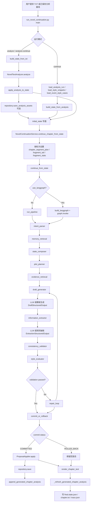

# 小说续写项目核心类设计与执行流程深度说明

## 1. 文档目的

这份文档基于当前工作区里的最新代码与文档，回答四个问题：

1. 这个项目现在的核心类和对象关系是什么。
2. 从“分析原文”到“接收用户指令”再到“生成续写正文”的执行流程是什么。
3. 各阶段具体由哪些方法和函数完成，分别改写了哪些状态字段。
4. 调用大模型时，prompt 组装、请求发送、JSON 解析、失败回退、日志审计是怎么串起来的。

本说明重点参考：

- `docs/10_runtime_io_audit.md`
- `docs/11_style_capture_modeling.md`
- `docs/13_full_change_record.md`
- `src/narrative_state_engine/models.py`
- `src/narrative_state_engine/application.py`
- `src/narrative_state_engine/graph/nodes.py`
- `src/narrative_state_engine/graph/workflow.py`
- `src/narrative_state_engine/analysis/*`
- `src/narrative_state_engine/llm/*`
- `src/narrative_state_engine/storage/repository.py`
- `run_novel_continuation.py`

## 2. 一句话结论

当前项目不是“把用户指令直接丢给模型生成一段文本”的写作脚本，而是一个：

- 先把原文分析成结构化资产；
- 再把用户任务映射成结构化状态；
- 再通过固定节点链路做检索、生成、抽取、校验、修复、提交；
- 最后只把“验证通过的状态更新”写回长期记忆和仓储

的 `state-first` 小说续写引擎。

真正的核心不是某个 prompt，而是下面这三个中心对象：

1. `NovelAgentState`
   负责承载整轮任务的统一状态。
2. `NovelContinuationService`
   负责驱动章节级或单轮级续写。
3. `graph/nodes.py` 中的节点函数链
   负责把状态一步步推进到可提交结果。

## 3. 当前架构的主干分层

| 层 | 代表对象/模块 | 作用 |
|---|---|---|
| 入口层 | `run_novel_continuation.py` | 解析参数、加载 TXT、决定是“先分析再续写”还是“基于已保存分析继续” |
| 分析层 | `TextChunker`、`NovelTextAnalyzer` | 把超长原文切块并抽出角色卡、剧情线、世界规则、风格画像、句子资产、事件样例 |
| 状态映射层 | `apply_analysis_to_state` | 把分析资产合并进统一的 `NovelAgentState` |
| 应用服务层 | `NovelContinuationService` | 组织单轮续写或章节多轮续写 |
| 编排层 | `run_pipeline` / `build_langgraph` | 调度节点执行顺序 |
| 节点层 | `intent_parser` 到 `commit_or_rollback` | 每个节点只负责一个明确状态变换 |
| 检索层 | `EvidencePackBuilder` | 组装 Evidence Pack，给生成提供风格句和事件样例 |
| 生成/抽取层 | `LLMDraftGenerator`、`LLMInformationExtractor` 及其回退实现 | 生成结构化草稿、抽取结构化 proposal |
| 校验层 | `consistency_validator`、`style_evaluator`、`repair_loop` | 保证设定一致、风格约束和可提交性 |
| 提交层 | `commit_or_rollback`、`ProposalApplier` | 决定提交/回滚，并把 accepted changes 真正应用到 canonical state |
| 持久化层 | `StoryStateRepository` | 保存状态版本、分析资产、剧情血缘、冲突队列 |
| 观测层 | `llm/client.py`、`logging/interaction.py`、`logging/token_usage.py` | 记录 LLM 请求生命周期、token usage、JSON 失败轨迹 |

## 4. 核心类 UML 图

```mermaid
classDiagram
    class NovelContinuationService {
        +continue_from_state(state, persist, use_langgraph, llm_model_name)
        +continue_chapter_from_state(state, max_rounds, completion_policy, persist, use_langgraph, llm_model_name)
        +continue_story(story_id, user_input, persist, use_langgraph, llm_model_name)
        +get_story_state_version(story_id, version_no)
        +get_story_replay_lineage(story_id, limit)
    }

    class ProposalApplier {
        +apply(state) NovelAgentState
        -_detect_conflict(state, change) ConflictRecord
        -_apply_change(state, change)
    }

    class ChapterCompletionPolicy {
        +min_chars
        +min_paragraphs
        +min_structure_anchors
        +plot_progress_min_score
        +weight_chars
        +weight_structure
        +weight_plot_progress
        +completion_threshold
        +normalized()
    }

    class NovelAgentState {
        +thread: ThreadState
        +story: StoryState
        +chapter: ChapterState
        +style: StyleState
        +analysis: AnalysisState
        +preference: PreferenceState
        +memory: MemoryBundle
        +draft: DraftCandidate
        +validation: ValidationState
        +commit: CommitDecision
        +metadata: dict
    }

    class ThreadState {
        +thread_id
        +request_id
        +user_input
        +intent
        +working_summary
        +retrieved_memory_ids
        +pending_changes
    }

    class StoryState {
        +story_id
        +title
        +premise
        +world_rules
        +world_rules_typed
        +major_arcs
        +characters
        +event_log
        +public_facts
        +secret_facts
    }

    class ChapterState {
        +chapter_id
        +chapter_number
        +pov_character_id
        +latest_summary
        +objective
        +content
        +open_questions
        +scene_cards
    }

    class StyleState {
        +narrative_pov
        +tense
        +dialogue_ratio
        +description_ratio
        +internal_monologue_ratio
        +rhetoric_preferences
        +forbidden_patterns
        +sentence_length_distribution
        +description_mix
        +dialogue_signature
        +rhetoric_markers
        +lexical_fingerprint
        +negative_style_rules
    }

    class AnalysisState {
        +analysis_version
        +baseline_global_state
        +chapter_states
        +chapter_synopsis_index
        +story_synopsis
        +coverage
        +retrieved_snippet_ids
        +retrieved_case_ids
        +story_bible_snapshot
        +snippet_bank
        +event_style_cases
        +evidence_pack
    }

    class DraftCandidate {
        +content
        +rationale
        +planned_beat
        +style_targets
        +continuity_notes
        +style_constraint_compliance
        +rule_violations
        +extracted_updates
        +raw_payload
    }

    class ValidationState {
        +status
        +consistency_issues
        +style_issues
        +requires_human_review
    }

    class CommitDecision {
        +status
        +accepted_changes
        +rejected_changes
        +conflict_changes
        +conflict_records
        +reason
    }

    class PlotThread
    class CharacterState
    class EventRecord
    class WorldRuleEntry
    class StateChangeProposal
    class ConflictRecord
    class MemoryBundle

    class NovelTextAnalyzer {
        +analyze(source_text, story_id, story_title) AnalysisRunResult
    }

    class TextChunker {
        +chunk(text) list~TextChunk~
    }

    class AnalysisRunResult {
        +chunks
        +chunk_states
        +chapter_states
        +global_story_state
        +snippet_bank
        +event_style_cases
        +story_bible
        +story_synopsis
        +coverage
        +summary
    }

    class EvidencePackBuilder {
        +build(state, snippets, event_cases) dict
    }

    class NodeRuntime {
        +memory_store
        +unit_of_work
        +generator
        +extractor
        +repository
        +evidence_builder
        +max_repair_attempts
    }

    class DraftGenerator {
        <<interface>>
        +generate(state)
    }

    class TemplateDraftGenerator {
        +generate(state)
    }

    class LLMDraftGenerator {
        +generate(state)
    }

    class InformationExtractor {
        <<interface>>
        +extract(state)
    }

    class RuleBasedInformationExtractor {
        +extract(state)
    }

    class LLMInformationExtractor {
        +extract(state)
    }

    class LongTermMemoryStore {
        <<interface>>
        +retrieve(state)
        +persist_validated_state(state)
    }

    class InMemoryMemoryStore {
        +retrieve(state)
        +persist_validated_state(state)
    }

    class UnitOfWork {
        <<interface>>
        +commit(state)
        +rollback(state)
    }

    class InMemoryUnitOfWork {
        +commit(state)
        +rollback(state)
    }

    class StoryStateRepository {
        <<interface>>
        +get(story_id)
        +save(state)
        +save_analysis_assets(analysis)
        +load_style_snippets(story_id)
        +load_event_style_cases(story_id)
        +load_latest_story_bible(story_id)
        +get_by_version(story_id, version_no)
        +load_story_version_lineage(story_id, limit)
    }

    class InMemoryStoryStateRepository
    class PostgreSQLStoryStateRepository

    NovelContinuationService --> ProposalApplier
    NovelContinuationService --> StoryStateRepository
    NovelContinuationService --> ChapterCompletionPolicy
    NovelContinuationService ..> NovelTextAnalyzer

    NovelAgentState *-- ThreadState
    NovelAgentState *-- StoryState
    NovelAgentState *-- ChapterState
    NovelAgentState *-- StyleState
    NovelAgentState *-- AnalysisState
    NovelAgentState *-- MemoryBundle
    NovelAgentState *-- DraftCandidate
    NovelAgentState *-- ValidationState
    NovelAgentState *-- CommitDecision

    StoryState o-- PlotThread
    StoryState o-- CharacterState
    StoryState o-- EventRecord
    StoryState o-- WorldRuleEntry
    ThreadState o-- StateChangeProposal
    DraftCandidate o-- StateChangeProposal
    CommitDecision o-- StateChangeProposal
    CommitDecision o-- ConflictRecord

    NovelTextAnalyzer --> TextChunker
    NovelTextAnalyzer --> AnalysisRunResult
    NodeRuntime --> LongTermMemoryStore
    NodeRuntime --> UnitOfWork
    NodeRuntime --> DraftGenerator
    NodeRuntime --> InformationExtractor
    NodeRuntime --> StoryStateRepository
    NodeRuntime --> EvidencePackBuilder

    TemplateDraftGenerator ..|> DraftGenerator
    LLMDraftGenerator ..|> DraftGenerator
    RuleBasedInformationExtractor ..|> InformationExtractor
    LLMInformationExtractor ..|> InformationExtractor
    InMemoryMemoryStore ..|> LongTermMemoryStore
    InMemoryUnitOfWork ..|> UnitOfWork
    InMemoryStoryStateRepository ..|> StoryStateRepository
    PostgreSQLStoryStateRepository ..|> StoryStateRepository
```

## 5. 最核心的设计中心：`NovelAgentState`

### 5.1 为什么它是项目中心

这个项目几乎所有模块都不直接“传 prompt 字符串”，而是传 `NovelAgentState`。  
换句话说，节点不是围绕文本在转，而是围绕状态在转。

### 5.2 `NovelAgentState` 的 10 个子状态

| 子状态 | 主要职责 | 被谁读写 |
|---|---|---|
| `thread` | 当前请求、意图、工作摘要、待提交 proposal | `intent_parser`、`state_composer`、`information_extractor` |
| `story` | 整本书的长期 canon，包括人物、规则、剧情线、事件日志 | 分析映射器、`ProposalApplier`、仓储层 |
| `chapter` | 当前章节局部上下文 | 入口脚本、分析映射器、渲染器 |
| `style` | 风格约束和统计画像 | 分析映射器、检索、prompt 构造、校验 |
| `analysis` | 分析资产与 Evidence Pack | 分析器、检索器、渲染后分析回写 |
| `preference` | 用户偏好和禁用项 | 入口构造、抽取 proposal、校验 |
| `memory` | 本轮从长期记忆检索回来的切片 | `memory_retrieval` |
| `draft` | 结构化草稿输出 | `draft_generator`、`repair_loop` |
| `validation` | 校验结果 | `consistency_validator`、`style_evaluator` |
| `commit` | 提交决策与冲突记录 | `commit_or_rollback`、`ProposalApplier` |

### 5.3 这套状态树的实际意义

这使得系统可以把一次续写拆成：

1. 先决定“本轮任务是什么”。
2. 再取“哪些旧状态与本轮相关”。
3. 再生成“候选正文”。
4. 再把正文抽回“结构化状态更新”。
5. 再验证“这些更新能不能变成 canon”。

所以项目的真实产出不是只看 `draft.content`，而是同时看：

- `draft.content`
- `thread.pending_changes`
- `validation`
- `commit`

## 6. 应用服务层：谁在驱动整个任务

## 6.1 `NovelContinuationService`

它是应用层总入口，核心方法有三组：

### `continue_from_state(...)`

职责：

- 初始化日志上下文。
- 复制输入状态，避免直接修改外部对象。
- 选择顺序版 `run_pipeline(...)` 或 LangGraph 版 `build_langgraph(...)`。
- 在 pipeline 成功 commit 后，调用 `ProposalApplier.apply(...)` 把 accepted proposals 真正写进 canonical state。
- 调用 `repository.save(...)` 保存状态版本。

这说明它本身不做“写作推理”，它做的是“任务编排 + 持久化收口”。

### `continue_chapter_from_state(...)`

这是章节级多轮编排器，也是当前正式运行路径的关键方法。

它在单轮 pipeline 外面又包了一层章节循环，负责：

- 根据用户指令推断目标字数；
- 为每一轮分配一个片段写作配额；
- 记录当前已写字数、剩余轮次、尾部上下文；
- 每轮都调用一次 `continue_from_state(...)`；
- 若本轮成功 commit，就把 `draft.content` 收进 `chapter_fragments`；
- 调用 `_evaluate_chapter_completion(...)` 判断整章是否已经达到完成标准；
- 最终调用 `render_chapter_text(...)` 把多轮片段拼成完整章节；
- 再调用 `_refresh_generated_chapter_analysis(...)` 把生成出来的新章节重新分析回写到 `state.analysis.chapter_states`。

可以把它理解成：

`章节编排器 = 多轮局部续写 + 完成判定 + 最终章节渲染 + 生成后反分析`

### `continue_story(...)`

职责比较简单：

- 从 repository 取既有 story state；
- 把新的 `user_input` 填进 `thread.user_input`；
- 清掉本轮临时字段；
- 再调用 `continue_from_state(...)`。

这说明 repository 不只是存档，也支持“从上一版本继续写下一轮”。

## 6.2 `ChapterCompletionPolicy`

这个类的作用不是写内容，而是定义“什么叫这一章已经写够了”。

`normalized()` 会做三件事：

1. 把最小字数、最小段落等硬门槛规范化。
2. 把 plot progress 阈值和 completion threshold 限制在 `0~1`。
3. 把三个权重归一化。

### 完成判定的核心逻辑

`_evaluate_chapter_completion(...)` 同时检查：

1. `commit.status == COMMITTED`
2. `validation.status == PASSED`
3. 字数达到 `min_chars`
4. 段落达到 `min_paragraphs`
5. 命中的结构锚点数达到 `min_structure_anchors`
6. `plot_progress_score >= plot_progress_min_score`
7. 加权分数 `weighted_score >= completion_threshold`

所以这不是一个纯“生成到一定字数就停”的系统，而是：

`文本长度 + 剧情推进 + 结构锚点 + 提交状态 + 校验状态`

共同决定章节是否结束。

## 6.3 `ProposalApplier`

这是 canonical state 更新器。

它只处理已经进入 `commit.accepted_changes` 的 proposal，但仍然会在最后一刻再做一次冲突检测。

### `apply(state)`

流程：

1. 深拷贝状态。
2. 先把 `draft.content` 写到 `chapter.content`。
3. 遍历 `commit.accepted_changes`。
4. 每条 proposal 先过 `_detect_conflict(...)`。
5. 无冲突则 `_apply_change(...)`。
6. 有冲突则移入 `commit.conflict_changes` 和 `commit.conflict_records`。
7. 更新 `chapter.latest_summary` 和 `metadata`。

### `_detect_conflict(...)`

按 `UpdateType` 分类处理：

| UpdateType | 冲突检查方式 |
|---|---|
| `EVENT` | 如果 `event_id` 已存在且 summary 不同，判冲突 |
| `WORLD_FACT` | 与 `world_rules/public_facts/secret_facts` 做语义同义/否定冲突检测 |
| `CHARACTER_STATE` | 到对应角色的具体字段里检查是否和已有状态冲突 |
| `RELATIONSHIP` | 与 `relationship_notes` 比较 |
| `PLOT_PROGRESS` | 如果剧情线已关闭却又想重开，判冲突 |
| `PREFERENCE` | 若已有确认偏好和新值不一致，判冲突 |

### `_apply_change(...)`

这一步才是真正把 proposal 写回 story/style/preference：

| UpdateType | 写入目标 |
|---|---|
| `EVENT` | `story.event_log` |
| `WORLD_FACT` | `story.public_facts` 或 `story.secret_facts` |
| `CHARACTER_STATE` | 对应 `CharacterState` 的目标字段 |
| `RELATIONSHIP` | `character.relationship_notes` |
| `PLOT_PROGRESS` | `PlotThread.next_expected_beat/status` |
| `STYLE_NOTE` | `style.rhetoric_preferences` |
| `PREFERENCE` | `preference.pace/preferred_mood/blocked_tropes` |

这说明节点链负责“得出 proposal”，而 `ProposalApplier` 才负责“把 proposal 变成 canonical object graph”。

## 7. 分析层：先分析原文是怎么完成的

## 7.1 `TextChunker`

它是分析层的第一步。

### `chunk(text)`

工作方式：

1. 统一换行。
2. 调 `_split_sections(...)` 先按“第 N 章 / Chapter N”类标题切章节。
3. 每个章节再进入 `_rolling_chunks(...)` 做滑窗切块。

### `_split_sections(...)`

用章节标题正则把全文拆成多个 section，每个 section 保留：

- `heading`
- `text`
- `start_offset`

### `_rolling_chunks(...)`

这是重叠滑窗切块器：

- `max_chunk_chars` 控制单块最大长度；
- `overlap_chars` 控制相邻块重叠；
- 尾部过短小块会并回上一块。

最终产物是 `TextChunk`。

## 7.2 `NovelTextAnalyzer`

这是“先分析再续写”的核心分析器。

### `analyze(source_text, story_id, story_title)`

完整流程是：

1. `TextChunker.chunk(...)` 产出 `chunks`
2. 对每个 chunk：
   - `_build_chunk_snippets(...)` 提取句子资产
   - `_analyze_chunk(...)` 提取块级事件、人物、规则、问题、风格特征
3. `_build_story_bible(...)` 产出 Story Bible
4. `_build_chapter_states(...)` 产出章节级分析状态
5. `_build_event_style_cases(...)` 产出事件样例库
6. `_build_coverage(...)` 产出覆盖率和偏移审计
7. `_build_story_synopsis(...)` 产出全书摘要
8. `_build_global_story_state(...)` 产出全局分析快照
9. 封装成 `AnalysisRunResult`

### `_build_chunk_snippets(...)`

把 chunk 拆句后，为每个句子分类：

- `action`
- `expression`
- `appearance`
- `environment`
- `dialogue`
- `inner_monologue`
- `other`

并产出 `StyleSnippetAsset`，包含：

- `snippet_id`
- `snippet_type`
- `text`
- `normalized_template`
- `style_tags`
- `chapter_number`
- `source_offset`

### `_analyze_chunk(...)`

会从单个块里提取：

- `summary`
- `key_events`
- `open_questions`
- `character_mentions`
- `world_rule_candidates`
- `plot_thread_candidates`
- `style_features`
- `coverage_flags`

### `_build_story_bible(...)`

进一步聚合出四大资产：

1. `character_cards`
2. `plot_threads`
3. `world_rules`
4. `style_profile`

### `_build_style_profile(...)`

这一步把“作者写法”显式结构化，得到：

- 句长分布 `sentence_length_distribution`
- 描写占比 `description_mix`
- 对话签名 `dialogue_signature`
- 修辞标记 `rhetoric_markers`
- 词汇指纹 `lexical_fingerprint`
- 负面风格规则 `negative_style_rules`

这部分就是 `docs/11_style_capture_modeling.md` 里 “把风格从隐式 prompt 变成结构化资产” 的代码落地。

## 7.3 `apply_analysis_to_state(...)`

这个函数是分析层和运行态之间的桥。

它做的不是简单赋值，而是“资产合并”：

### 风格映射

把 `analysis.story_bible.style_profile` 写进：

- `state.style.sentence_length_distribution`
- `state.style.description_mix`
- `state.style.dialogue_signature`
- `state.style.rhetoric_markers`
- `state.style.lexical_fingerprint`
- `state.style.negative_style_rules`
- `state.style.rhetoric_preferences`

同时还会从 `dialogue_signature` 和 `description_mix` 反推：

- `style.dialogue_ratio`
- `style.description_ratio`
- `style.internal_monologue_ratio`

### 分析资产映射

把分析结果写进：

- `state.analysis.analysis_version`
- `state.analysis.baseline_global_state`
- `state.analysis.chapter_states`
- `state.analysis.chapter_synopsis_index`
- `state.analysis.story_synopsis`
- `state.analysis.coverage`
- `state.analysis.story_bible_snapshot`
- `state.analysis.snippet_bank`
- `state.analysis.event_style_cases`

### 证据预填充

它还会先生成一版基础 `state.analysis.evidence_pack`，里面包含：

- 按类型分桶的 `style_snippet_examples`
- 精简版 `event_case_examples`
- `story_synopsis`

也就是说，即使后面没从数据库再检索，状态里本身也已经带了一份可直接用的风格证据。

### Story/Chapter 映射

它还会把分析资产合并到运行状态：

- `story.world_rules_typed`
- `story.world_rules`
- `story.characters`
- `story.major_arcs`
- `chapter.latest_summary`
- `chapter.open_questions`
- `chapter.scene_cards`

因此分析层的输出并不是留在孤立 JSON 里，而是被转成后续所有节点都能直接消费的统一状态。

## 8. 运行时流程图

## 9. 节点链逐方法说明

下面这部分是当前项目最关键的“方法级调用链说明”。

## 9.1 `intent_parser(state, runtime)`

职责：

- 读取 `state.thread.user_input`
- 用规则匹配判断用户意图

写入字段：

- `state.thread.intent`

当前分类：

- `rewrite`
- `imitate`
- `validate`
- 默认 `continue`

这是轻量规则节点，不调用模型。

## 9.2 `memory_retrieval(state, runtime)`

职责：

- 调 `runtime.memory_store.retrieve(state)`
- 把长期记忆裁剪成当前轮次要用的 `MemoryBundle`

默认实现是 `InMemoryMemoryStore.retrieve(...)`，它从现有 story/style/preference 里抽：

- `episodic`: 最近事件
- `semantic`: 世界规则与公开事实
- `character`: 人物声音摘要
- `plot`: 剧情推进点
- `style`: 修辞偏好和 hook
- `preference`: 节奏和氛围

写入字段：

- `state.memory`
- `state.thread.retrieved_memory_ids`

## 9.3 `state_composer(state, runtime)`

职责：

- 将章节目标、上章摘要、plot memory、style memory 组合成当前轮工作摘要

写入字段：

- `state.thread.working_summary`

它是 prompt 前的一次“中间态压缩”，但仍然不直接调用模型。

## 9.4 `plot_planner(state, runtime)`

职责：

- 从 `story.major_arcs[0]` 选当前主推进线；
- 取 `next_expected_beat` 作为本轮推进点。

写入字段：

- `state.metadata["selected_plot_thread"]`
- `state.metadata["planned_beat"]`

如果没有剧情线，就退回 `chapter.objective`。

## 9.5 `evidence_retrieval(state, runtime)`

这是新版本相对旧文档最重要的增强节点之一。

职责：

1. 从 repository 加载：
   - `load_style_snippets(...)`
   - `load_event_style_cases(...)`
2. 调 `runtime.evidence_builder.build(...)`
3. 得到一份 Evidence Pack

写入字段：

- `state.analysis.evidence_pack`
- `state.analysis.retrieved_snippet_ids`
- `state.analysis.retrieved_case_ids`

### `EvidencePackBuilder.build(...)` 的内部逻辑

#### `_build_query(state)`

把以下内容拼成检索查询：

- `thread.user_input`
- `chapter.objective`
- `chapter.latest_summary`
- `metadata.planned_beat`
- `chapter.open_questions`
- `memory.plot`

#### `_collect_snippet_pool(...)`

把候选句子资产从四个来源合并起来：

1. 仓储层 style snippets
2. `state.analysis.snippet_bank`
3. `state.analysis.evidence_pack` 里已有的 examples
4. `state.metadata["analysis_snippet_bank"]`

#### `_score_snippet_pool(...)`

每条 snippet 有两个分：

- `semantic_score`
  基于 query token 和 candidate token 的重合度
- `structural_score`
  基于 `style.description_mix`、`style.dialogue_ratio`、开放问题、intent 类型

最终：

`combined_score = semantic_weight * semantic_score + structural_weight * structural_score`

默认权重是：

- 语义 0.7
- 结构 0.3

#### `_score_event_cases(...)`

对事件样例也打双分：

- 语义匹配
- 结构匹配

结构匹配会看：

- `planned_beat` 是否和 `event_type` 接近
- 参与者是否匹配已知角色
- 是否符合当前对话比例和环境描写比例

#### `_select_by_quota(...)`

最后按配额选句：

- action
- expression
- appearance
- environment
- dialogue
- inner_monologue

这就是“证据优先续写”的落地代码。

## 9.6 `draft_generator(state, runtime)`

职责：

- 调 `runtime.generator.generate(state)`
- 若失败则回退模板生成器
- 把结构化 draft 写回状态

写入字段：

- `state.draft.content`
- `state.draft.rationale`
- `state.draft.planned_beat`
- `state.draft.style_targets`
- `state.draft.continuity_notes`
- `state.draft.raw_payload`
- `state.metadata["retrieved_snippet_ids"]`
- `state.metadata["retrieved_case_ids"]`

### 默认会选哪个 generator

`make_runtime(...)` 会先看 `has_llm_configuration(...)`：

- 有完整 LLM 配置：
  - `generator = LLMDraftGenerator`
- 没有完整 LLM 配置：
  - `generator = TemplateDraftGenerator`

### `TemplateDraftGenerator.generate(...)`

模板生成器不调用模型，它会从状态里取：

- 主角
- planned beat
- scene hint
- latest summary
- open question
- evidence pack 里的 action/expression/environment/dialogue 样例

然后拼成一个可验证的占位续写段。

### `LLMDraftGenerator.generate(...)`

真正的模型生成路径是：

1. `build_draft_messages(state)`
2. `unified_text_llm(messages, json_mode=True, purpose="draft_generation", stream=False, ...)`
3. `JsonBlobParser.parse(response_text)`
4. 解析成功：
   - `_record_llm_success_trace(...)`
   - `DraftStructuredOutput.model_validate(parsed.data)`
5. 解析失败：
   - `_record_llm_parse_trace(...)`
   - 抛异常给外层 node
6. 外层 `draft_generator(...)` 捕获异常，回退 `TemplateDraftGenerator`

## 9.7 `information_extractor(state, runtime)`

职责：

- 从刚生成的正文里抽取可提交的状态更新 proposal

写入字段：

- `state.draft.extracted_updates`
- `state.thread.pending_changes`
- `state.metadata["extraction_notes"]`

### 默认会选哪个 extractor

- 有 LLM 配置：`LLMInformationExtractor`
- 无 LLM 配置：`RuleBasedInformationExtractor`

### `RuleBasedInformationExtractor.extract(...)`

规则抽取器会至少产出两类 proposal：

1. `EVENT`
2. `PLOT_PROGRESS`

它会根据：

- `draft.planned_beat`
- `chapter.chapter_number`
- 主角色引用
- 主剧情线引用
- `draft.content` 的摘要片段

构造 `StateChangeProposal`。

### `LLMInformationExtractor.extract(...)`

模型抽取路径与 draft 类似：

1. `build_extraction_messages(state)`
2. `unified_text_llm(... purpose="state_extraction", json_mode=True, stream=False)`
3. `JsonBlobParser.parse(...)`
4. 成功则返回 `ExtractionStructuredOutput`
5. 失败则由外层 node 回退 `RuleBasedInformationExtractor`

## 9.8 `consistency_validator(state, runtime)`

这是强门控的一致性校验器。

它不会直接给 commit.status 下结论，但会产出 consistency issue 列表，供后面的 `style_evaluator` 和 `commit_or_rollback` 使用。

写入字段：

- `state.draft.style_constraint_compliance`
- `state.draft.rule_violations`
- `state.validation.consistency_issues`

### 检查内容

#### 1. 负面风格规则

`_detect_negative_style_rule_violations(...)` 会检查 `style.negative_style_rules` 命中情况。

当前内置映射包括：

- `avoid_modern_internet_slang`
- `avoid_out_of_world_meta_explanation`

#### 2. 世界规则语义冲突

`_detect_world_rule_violations(...)` 会遍历：

- `state.story.world_rules_typed`
- 如果没有 typed rule，就退化为 legacy `world_rules`

然后对每条 proposal 调：

- `_proposal_conflicts_with_world_rule(change, rule_text, rule_type)`

这个函数会检查：

1. 禁止语义是否命中
2. 必需语义是否被否定
3. change summary 是否与 rule text 语义冲突
4. hard rule 下 world fact 是否被标成 unstable

#### 3. 用户偏好和禁用模式

检查：

- `preference.blocked_tropes`
- `style.forbidden_patterns`

#### 4. proposal 自身结构合法性

检查：

- `summary` 不能为空
- `confidence` 必须在 `0~1`
- `WORLD_FACT` 必须是 `stable_fact=True`

## 9.9 `style_evaluator(state, runtime)`

这一步负责把 consistency issue 和 style issue 收口成统一的 `validation.status`。

写入字段：

- `state.validation.style_issues`
- `state.validation.status`
- `state.validation.requires_human_review`

### 规则

1. 如果 consistency 里有任一 `error`：
   - `status = FAILED`
2. 否则如果 style 上有 warning：
   - `status = NEEDS_HUMAN_REVIEW`
3. 否则：
   - `status = PASSED`

### 当前 style issue 检查内容

- 草稿太短
- 缺少 `style_targets`
- 缺少 `continuity_notes`

## 9.10 `repair_loop(state, runtime)`

这是另一个新版本关键增强点。

它只在 `validation.status != PASSED` 时执行。

流程：

1. `_build_repair_prompt(state)`
2. 把 repair prompt 写入：
   - `metadata["repair_prompt"]`
   - `metadata["repair_attempt"]`
3. 再次调用：
   - `draft_generator(...)`
   - `_apply_rule_based_repair_to_draft(...)`
   - `information_extractor(...)`
   - `consistency_validator(...)`
   - `style_evaluator(...)`
4. 把每轮情况记到 `metadata["repair_history"]`

### `_build_repair_prompt(state)`

它会把最近的：

- consistency issues
- style issues
- retrieved snippet ids

组合成一个“针对问题修正”的提示。

### `_apply_rule_based_repair_to_draft(state)`

这是本地补救逻辑，不调用模型：

- 删除命中的 blocked trope / forbidden pattern
- 如果文本太短，就补一句占位承接句
- 如果缺少 style_targets / continuity_notes，就补默认值

所以 repair loop 不是纯 LLM retry，而是：

`LLM 重生 + 本地规则修补 + 重新抽取 + 重新校验`

## 9.11 `human_review_gate(state, runtime)`

目前还是内部节点，不对外暴露人工审核 API。

职责：

- 只是在 `metadata["human_review_note"]` 里记录说明

它的存在意义是为以后接入人工复核工作流预留固定节点位置。

## 9.12 `commit_or_rollback(state, runtime)`

这是节点链的最终提交闸门。

### 规则

#### `FAILED`

- `commit.status = ROLLED_BACK`
- `commit.rejected_changes = pending_changes`
- `unit_of_work.rollback(state)`

#### `NEEDS_HUMAN_REVIEW`

- 同样 `ROLLED_BACK`
- 理由是“等待人工审核”
- 也会 `rollback`

#### `PASSED`

- `commit.status = COMMITTED`
- `commit.accepted_changes = pending_changes`
- `unit_of_work.commit(state)`
- `memory_store.persist_validated_state(state)`

所以：

- `validation` 决定可不可以提交
- `commit` 才是最终提交动作

## 10. 模型交互链路：大模型到底是怎么被调起来的

## 10.1 Prompt 是怎么构造的

### `build_draft_messages(state)`

它会把以下状态拼成 draft prompt：

- 作品标题、前提
- 章节目标、上章摘要
- 开放问题、场景卡
- 世界规则
- plot memory、character memory
- 风格约束
- 风格统计
- Evidence Pack 中的 style snippet examples
- Evidence Pack 中的 event case examples
- 已写片段尾部
- 当前轮的 segment plan
- repair prompt
- 用户偏好
- 当前用户请求
- 严格 JSON schema

这意味着模型拿到的不是“用户指令 + 原文大段拼接”，而是：

`状态压缩摘要 + 风格统计 + 可追溯证据 + 结构化输出协议`

### `build_extraction_messages(state)`

抽取 prompt 则聚焦于：

- 当前章节号
- 刚生成的正文
- 已有世界规则
- 最近已有事件
- proposal JSON schema

## 10.2 LLM 客户端是怎么工作的

真正统一入口是：

`unified_text_llm(messages, **kwargs)`

### 步骤 1：解析配置

来自 `NovelLLMConfig.from_env()`：

- `NOVEL_AGENT_LLM_API_BASE`
- `NOVEL_AGENT_LLM_API_KEY`
- `NOVEL_AGENT_LLM_MODEL`
- 以及 temperature / max_tokens / timeout 等参数

### 步骤 2：解析 endpoint 池

`_resolve_endpoints(...)` 支持：

- 单个 base/key
- 多个 `API_BASES` / `API_KEYS`
- 通过 `EndpointPool` 做起始索引轮换

也就是说，这个客户端已经具备简单的多 endpoint 轮询和故障转移能力。

### 步骤 3：记录交互开始事件

调用：

- `new_interaction_id()`
- `record_llm_interaction(... event_type="llm_request_started")`

同时还会：

- 生成 `interaction_id`
- 记录 `purpose`
- 记录 request summary
- 记录 request options

### 步骤 4：真实发请求

底层实现类是 `OpenAITextLLM`。

它最终调用：

- `self.client.chat.completions.create(...)`

关键点：

- `json_mode=True` 时会带 `response_format={"type": "json_object"}`
- 当前 draft/extraction 都显式传了 `stream=False`
- 返回后会统一抽取 usage 信息

### 步骤 5：记录成功或失败

成功时：

- `record_llm_token_usage(...)`
- `record_llm_interaction(... event_type="llm_request_succeeded")`

失败时：

- `_is_transient_error(...)` 判断是否可重试
- 记录 `llm_request_failed`
- 如可重试则记录 `llm_request_retrying`
- 多 endpoint / 多 attempt 都失败后抛 `RuntimeError`

## 10.3 JSON 解析与修复

模型返回的文本不是直接当结果用，而是先进入 `JsonBlobParser.parse(...)`。

### `extract_json_text(...)`

支持从下面几种输出里抽 JSON：

- 裸对象
- 裸数组
- fenced code block
- 文本中包裹的平衡大括号对象

### `parse(...)`

顺序是：

1. 直接 `json.loads(raw)`
2. 若失败，调用 `_repair_common_json(raw)`：
   - 规范化智能引号
   - 转义字符串里的控制字符
   - 删除尾逗号
3. 再次 `json.loads(repaired_raw)`
4. 若还失败，尝试 `_to_python_literal_candidate(...) + ast.literal_eval(...)`
5. 最终返回 `JsonParseResult`

### 解析轨迹写到哪里

在 Draft/Extraction 的 LLM 类中，解析结果会进一步写进：

- `state.metadata["llm_stage_traces"]`
- `state.metadata["llm_json_failure_count"]`
- `state.metadata["last_llm_json_failure"]`
- `state.metadata["last_llm_interaction_id"]`

也就是说，这个系统除了通用 interaction log 外，还把“节点级 JSON 失败轨迹”挂到了状态快照里，方便后续审计。

## 10.4 模型失败后的回退策略

### Draft 失败

- `LLMDraftGenerator.generate(...)` 抛异常
- `draft_generator(...)` 捕获
- 回退到 `TemplateDraftGenerator`

### Extraction 失败

- `LLMInformationExtractor.extract(...)` 抛异常
- `information_extractor(...)` 捕获
- 回退到 `RuleBasedInformationExtractor`

所以系统的稳定性策略不是“模型必须成功”，而是：

`优先结构化 LLM -> JSON 解析修复 -> 节点级 fallback`

## 11. 入口脚本如何把这些拼起来

## 11.1 `run_novel_continuation.py`

这个脚本是当前最完整的运行入口。

它支持两大模式：

### 模式 A：`analyze` / `analyze-continue`

调用路径：

1. `_read_text_with_fallback(...)` 读 TXT
2. `build_state_from_txt(...)` 构造基础 `NovelAgentState`
3. `NovelTextAnalyzer.analyze(...)`
4. `apply_analysis_to_state(...)`
5. 可选 `repository.save_analysis_assets(...)`
6. 写出 `analysis.json` 和 `initial.state.json`
7. 若是 `analyze-continue`，继续进入章节续写

### 模式 B：`continue`

调用路径：

1. `_load_analysis_payload(...)`
2. `build_state_from_analysis(...)`
3. 进入章节续写

### `build_state_from_txt(...)`

它负责从原始 TXT 直接构造“最低可运行状态”：

- 章节摘要来自 `_extract_tail_summary(...)`
- 开放问题来自 `_extract_open_questions(...)`
- 章节目标来自 instruction
- 自动造一个默认主角和主剧情线
- 把整个 source text 暂存到 `chapter.content`

### `build_state_from_analysis(...)`

它负责从 `AnalysisRunResult` 反推运行态：

- 从 `global_story_state.character_registry` 还原角色
- 从 `plot_threads` 还原 major arcs
- 从 `world_rules` 还原 typed rules
- 从最后一章分析态取 `latest_summary/open_questions/scene_cards`
- 再调 `apply_analysis_to_state(...)` 完成完整映射

### 最终输出文件

当前脚本固定会输出：

- `*.analysis.json`
- `*.initial.state.json`
- `*.final.state.json`
- `*.chapter.txt`
- `*.trace.json`

其中 `trace.json` 主要是 LLM 节点审计摘要：

- `llm_json_failure_count`
- `llm_json_failures`
- `llm_stage_traces`

## 12. 持久化层：类关系与对象如何落库

## 12.1 `StoryStateRepository` 协议

这是统一仓储抽象，定义了三类能力：

### A. 状态版本

- `get(story_id)`
- `save(state)`
- `get_by_version(story_id, version_no)`
- `load_story_version_lineage(story_id, limit)`

### B. 分析资产

- `save_analysis_assets(analysis)`
- `load_analysis_run(story_id, analysis_version)`
- `load_chapter_analysis_states(story_id)`
- `load_global_story_analysis(story_id)`
- `append_generated_chapter_analysis(story_id, chapter_state, state_version_no)`

### C. 检索资源

- `load_style_snippets(story_id, snippet_types, limit)`
- `load_event_style_cases(story_id, limit)`
- `load_latest_story_bible(story_id)`

## 12.2 `InMemoryStoryStateRepository`

这是默认可跑通的内存实现。

它维护：

- `states`
- `style_snippets`
- `event_style_cases`
- `story_bibles`
- `analysis_runs`
- `chapter_analysis_states`
- `global_story_analysis`
- `version_history`

它的意义是：即使没有数据库，整套 analyze-first + continue + lineage replay 逻辑也能本地跑通。

## 12.3 `PostgreSQLStoryStateRepository`

这是正式持久化实现。

### `save(state)`

除了保存 `story_versions.snapshot`，它还会刷新投影表：

- `stories`
- `threads`
- `chapters`
- `character_profiles`
- `world_facts`
- `plot_threads`
- `episodic_events`
- `style_profiles`
- `user_preferences`
- `validation_runs`
- `commit_log`
- `conflict_queue`

也就是说，数据库里既有完整 JSON 快照，也有可查询的投影视图。

### `save_analysis_assets(analysis)`

会写入：

- `analysis_runs`
- `story_bible_versions`
- `style_snippets`
- `event_style_cases`

这是分析层资产可追溯化的关键。

### `append_generated_chapter_analysis(...)`

在一章生成结束后，把新章节分析态追加回 `analysis_runs.result_summary.chapter_states`，让“原文分析基线”和“后续生成章节分析”在同一条 story lineage 里衔接起来。

## 13. 章节完成后，状态是如何闭环回来的

单轮 pipeline 提交成功后，章节级逻辑还会再做三件事：

1. `render_chapter_text(...)`
   把多轮片段去重、拼接，并补一个收束尾段。
2. `_refresh_generated_chapter_analysis(...)`
   对最终章节重新跑一次轻量分析，并回写 `state.analysis.chapter_states`、`story_synopsis`、`coverage`。
3. `repository.append_generated_chapter_analysis(...)`
   把新章节分析态更新回持久化分析基线。

这意味着项目不是“写完这一轮就结束”，而是：

`生成出的新正文 -> 再被分析成新资产 -> 再成为下一轮检索和续写的基础`

所以它天然支持跨轮次、跨章节的状态递进。

## 14. 当前版本里最重要的对象关系结论

如果只抓最关键的设计结论，可以概括成 8 句话：

1. `NovelAgentState` 是统一运行态根对象，所有节点只围绕它读写。
2. `AnalysisRunResult` 是离线/预处理分析产物，`apply_analysis_to_state(...)` 是它和运行态之间的桥。
3. `NovelContinuationService` 是应用层总调度器，不负责推理细节，但负责把一次任务真正跑完。
4. `NodeRuntime` 是节点依赖注入容器，把 memory/uow/generator/extractor/repository/evidence_builder 绑定到一轮执行上下文。
5. `DraftGenerator` 和 `InformationExtractor` 都是可替换策略接口，当前分别有 LLM 版和 fallback 版。
6. `EvidencePackBuilder` 让“风格模仿”从 prompt 经验变成可检索、可配额、可审计的资产使用流程。
7. `ProposalApplier` 让“生成结果”与“canonical state”解耦，避免 proposal 直接污染既有设定。
8. `StoryStateRepository` 让分析资产、状态版本、剧情血缘、冲突记录都能被统一保存和回放。

## 15. 当前设计最值得关注的三个优点与三个边界

### 优点

1. 结构非常清晰：分析、检索、生成、抽取、校验、提交都有单独对象和方法边界。
2. 可回退性很好：LLM 失败不会让整个系统完全不可用。
3. 可审计性很强：状态快照、analysis 资产、LLM interaction、JSON parse trace、版本血缘都能留痕。

### 当前边界

1. `human_review_gate` 仍然只是内部节点，还没有真正的外部人工审核接口。
2. `LangMemMemoryStore` 和 `Mem0MemoryStore` 还是占位适配器，当前真正跑通的是内存路径和 repository 路径。
3. `checkpoints` 表虽然在设计里存在，但逐节点 checkpoint 持久化目前还没有真正接到运行时。

## 16. 建议你以后看代码时的顺序

如果你想继续深入这个仓库，建议按下面顺序看：

1. `src/narrative_state_engine/models.py`
   先搞清楚总状态树。
2. `src/narrative_state_engine/application.py`
   再搞清楚单轮和章节级编排。
3. `src/narrative_state_engine/graph/nodes.py`
   再看每个节点到底改了哪些字段。
4. `src/narrative_state_engine/analysis/analyzer.py`
   再看“先分析”资产是怎么产出的。
5. `src/narrative_state_engine/retrieval/evidence_pack_builder.py`
   再看风格证据是怎么被检索和组装的。
6. `src/narrative_state_engine/llm/prompts.py` 和 `src/narrative_state_engine/llm/client.py`
   最后看 prompt 与模型交互细节。

这样阅读路径会最顺，不容易在很多模块之间来回跳。
